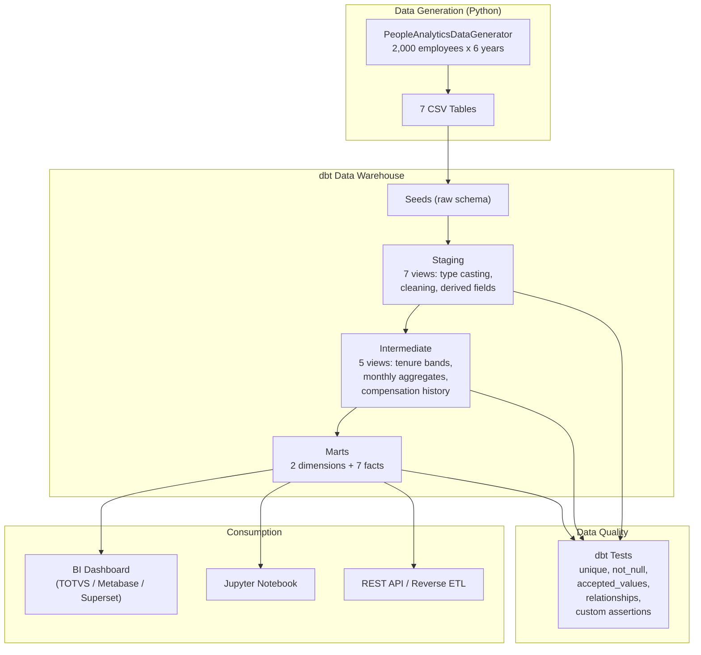
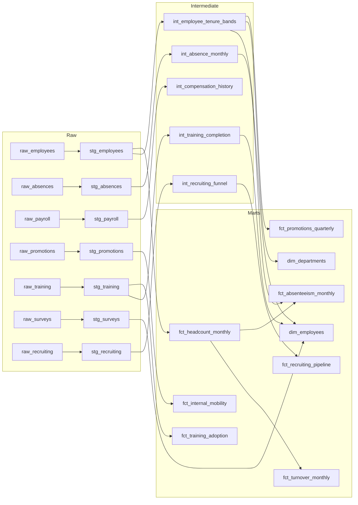
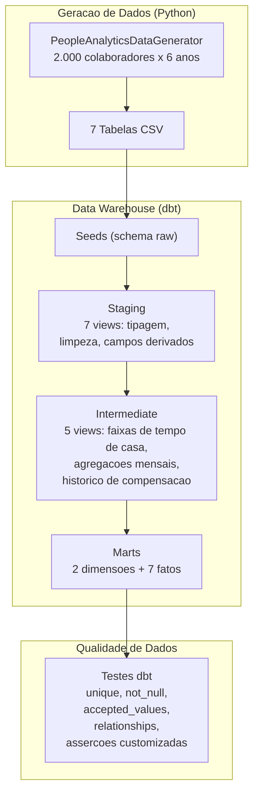

# People Analytics DWH — dbt + DuckDB

[](https://github.com/galafis/people-analytics-dwh-dbt/actions/workflows/ci.yml)


[English](#english) | [Portugues](#portugues)

---

## English

### Executive Summary

A **production-grade People Analytics Data Warehouse** built with dbt and DuckDB. Transforms 7 raw HR tables (employees, absences, payroll, promotions, training, surveys, recruiting) through a 3-layer architecture (staging → intermediate → marts) into 9 analytical models that power HR KPI dashboards — headcount, turnover, absenteeism, internal mobility, promotion equity, training adoption, and recruiting efficiency.

This project implements the **semantic layer** that enterprise People Analytics products (TOTVS RH People Analytics, Workday Prism, SAP SuccessFactors, Visier) use internally: curated, tested, documented data models that translate raw transactional HR data into business-meaningful metrics.

### Business Problem

HR departments across industries face a common challenge: **data exists in silos** — HRIS, payroll, ATS, LMS, survey tools — and joining them manually to answer strategic questions is slow, error-prone, and unrepeatable.

Key business questions this DWH answers:

- **Workforce Planning**: What is our headcount trend? Where are we growing or shrinking?
- **Attrition Analysis**: Which departments have the highest turnover? Is it voluntary or involuntary?
- **Absenteeism**: Where are absence patterns concerning? Who has high Bradford factors?
- **Career Development**: Are promotions equitable across gender, age, and tenure? Where is mobility stagnating?
- **Learning & Development**: Are employees completing mandatory training? Which departments are underinvesting?
- **Talent Acquisition**: How long does it take to fill positions? Which sources produce the best hires?

**Without a DWH**, these questions require ad-hoc SQL against production databases, manual spreadsheet joins, and inconsistent metric definitions. **With this DWH**, they become single-query lookups against certified mart tables.

### Architecture



#### dbt Lineage



### Data Model

#### Raw Tables (7)

| Table | Rows (est.) | Description |
|-------|:-----------:|-------------|
| raw_employees | 2,000 | Master employee records with full lifecycle |
| raw_absences | ~16,000 | Daily absence events by type |
| raw_payroll | ~50,000 | Monthly compensation records |
| raw_promotions | ~800 | Career progression events |
| raw_training | ~7,000 | Course enrollment and completion |
| raw_surveys | ~30,000 | Quarterly engagement survey responses |
| raw_recruiting | ~60,000 | Full hiring funnel records |

#### Mart Models (9)

| Model | Grain | Key Metrics |
|-------|-------|-------------|
| **dim_employees** | 1 row/employee | 360 profile: tenure band, salary band, training completion, latest survey scores |
| **dim_departments** | 1 row/dept | Headcount, avg salary, gender composition, tenure distribution |
| **fct_headcount_monthly** | month x dept | Active headcount, new hires, terminations |
| **fct_turnover_monthly** | month x dept | Turnover rate (total/voluntary/involuntary), net change |
| **fct_absenteeism_monthly** | month x dept | Absence rate, sick leave rate, Bradford factor |
| **fct_internal_mobility** | quarter x dept | Promotion count, lateral moves, mobility rate |
| **fct_promotions_quarterly** | quarter x dept x gender x tenure | Promotion rate, equity analysis by segment |
| **fct_training_adoption** | year x dept x category | Completion rate, mandatory compliance, hours/employee |
| **fct_recruiting_pipeline** | quarter x dept | Time-to-fill, source effectiveness, conversion rates |

> Full data dictionary: [`docs/data_dictionary.md`](docs/data_dictionary.md)

### Methodology

1. **Synthetic Data Generation** — Python generator (Faker + NumPy) creates 2,000 employees spanning 2019–2024 with statistically correlated features across all 7 tables. Distributions calibrated against SHRM 2023 benchmarks and BLS JOLTS data.

2. **dbt Staging Layer** — 7 views that cast types, clean nulls, extract date parts, and compute derived fields (tenure_years, is_voluntary_termination, total_compensation, etc.)

3. **dbt Intermediate Layer** — 5 enrichment views: tenure/age/salary banding, monthly absence aggregation, annual compensation history with YoY growth, per-employee training completion summary, per-requisition recruiting funnel metrics.

4. **dbt Marts Layer** — 2 dimension tables + 7 fact tables materialized as DuckDB tables. Each mart implements standard HR KPIs with the exact formulas used by enterprise People Analytics platforms.

5. **Data Quality** — 50+ dbt tests: `unique`, `not_null`, `accepted_values`, `relationships` (referential integrity), and 3 custom assertion tests (turnover rate bounds, absence rate bounds, hire-before-termination check).

6. **Documentation** — dbt docs auto-generated with model descriptions, column definitions, and lineage graphs.

### Results

#### Mart Table Examples

**Headcount Snapshot (fct_headcount_monthly):**

| Month | Department | Active | New Hires | Terminations |
|-------|-----------|:------:|:---------:|:------------:|
| 2024-06 | Engineering | 312 | 8 | 3 |
| 2024-06 | Sales | 278 | 5 | 7 |
| 2024-06 | Operations | 225 | 4 | 4 |

**Turnover Analysis (fct_turnover_monthly):**

| Department | Avg Monthly Rate | Annualized | Voluntary % |
|-----------|:----------------:|:----------:|:-----------:|
| Customer Support | 1.8% | 21.6% | 65% |
| Sales | 1.6% | 19.2% | 72% |
| Engineering | 1.1% | 13.2% | 80% |

*Note: Values vary by seed. Run `make pipeline` to reproduce.*

### SHAP / Explainability

This is a **Data Engineering** project, not an ML project — there are no model predictions to explain. However, the mart tables are specifically designed to **feed into** ML models and explainability tools:

- `dim_employees` provides the feature matrix for turnover prediction models
- `fct_turnover_monthly` provides the labeled outcomes (who left, when, why)
- Segment-level fact tables enable subgroup analysis for fairness auditing

### Fairness & Ethical Considerations

#### What This DWH Should NOT Be Used For
- **Individual employee profiling** without consent — aggregate reporting only
- **Automated HR decisions** (hiring, firing, promotion) — data informs, humans decide
- **Surveillance** — absence/survey data measures organizational health, not individual compliance
- **Discriminatory targeting** — promotion equity analysis should drive *inclusion*, not exclusion

#### Responsible Analytics Design Choices
- **No PII in marts** — employee names excluded from fact tables; only IDs for joins
- **Segment minimums** — promotion equity analysis flags unreliable metrics for groups < 30
- **Survey anonymity** — in production, survey data should be aggregated (min group size = 5) to prevent identification
- **Bradford Factor caution** — used for pattern detection, never for punitive action

#### Regulatory Context
- **LGPD (Brazil)**: Employee data is personal data; processing requires legitimate interest or consent
- **GDPR (EU)**: Same principles; data minimization applies to DWH design
- **EEOC (US)**: Promotion equity metrics directly support disparate impact analysis

### Limitations

1. **Synthetic data**: Correlations are approximated, not derived from real organizational dynamics
2. **No temporal causality**: DWH captures "what happened" but not "why" — causal inference requires experimental design
3. **Single-organization scope**: No multi-entity or multi-currency support
4. **DuckDB scale**: DuckDB handles millions of rows; for billions, migrate to BigQuery/Snowflake/Redshift
5. **No incremental loads**: Full refresh strategy — production systems need incremental materialization
6. **No CDC**: Change Data Capture not implemented — real systems need event-driven pipelines

### How to Run

#### Quick Start (Local)

```bash
# Clone
git clone https://github.com/galafis/people-analytics-dwh-dbt.git
cd people-analytics-dwh-dbt

# Install dependencies
make dev

# Full pipeline: generate data → dbt build → test
make pipeline

# Explore results
duckdb data/people_analytics.duckdb
# → SELECT * FROM marts.fct_turnover_monthly LIMIT 10;
```

#### Step-by-Step

```bash
# 1. Generate synthetic data (7 CSV files)
make generate-data

# 2. Install dbt packages
make dbt-deps

# 3. Load seeds into DuckDB
make dbt-seed

# 4. Run all dbt models (staging → intermediate → marts)
make dbt-run

# 5. Run all dbt tests (50+ tests)
make dbt-test

# 6. Generate and serve dbt documentation
make dbt-docs
make dbt-docs-serve
# → http://localhost:8080
```

#### Docker

```bash
# Run full pipeline in container
docker compose up pipeline

# Serve dbt docs
docker compose up dbt-docs
# → http://localhost:8080
```

#### Testing

```bash
# Python tests (generator + config)
make test

# With coverage
make test-cov

# Lint
make lint

# Type check
make type-check

# dbt tests (data quality)
make dbt-test
```

### Project Structure

```
people-analytics-dwh-dbt/
├── src/
│   ├── config.py                          # Pydantic BaseSettings
│   └── generate_data.py                   # Synthetic data generator (7 tables)
├── dbt_project/
│   ├── dbt_project.yml                    # dbt configuration
│   ├── profiles.yml                       # DuckDB connection profiles
│   ├── packages.yml                       # dbt_utils dependency
│   ├── models/
│   │   ├── staging/                       # 7 staging views + source/model YMLs
│   │   │   ├── _stg__sources.yml
│   │   │   ├── _stg__models.yml
│   │   │   ├── stg_employees.sql
│   │   │   ├── stg_absences.sql
│   │   │   ├── stg_payroll.sql
│   │   │   ├── stg_promotions.sql
│   │   │   ├── stg_training.sql
│   │   │   ├── stg_surveys.sql
│   │   │   └── stg_recruiting.sql
│   │   ├── intermediate/                  # 5 enrichment views
│   │   │   ├── _int__models.yml
│   │   │   ├── int_employee_tenure_bands.sql
│   │   │   ├── int_absence_monthly.sql
│   │   │   ├── int_compensation_history.sql
│   │   │   ├── int_training_completion.sql
│   │   │   └── int_recruiting_funnel.sql
│   │   └── marts/                         # 2 dims + 7 facts
│   │       ├── _marts__models.yml
│   │       ├── dim_employees.sql
│   │       ├── dim_departments.sql
│   │       ├── fct_headcount_monthly.sql
│   │       ├── fct_turnover_monthly.sql
│   │       ├── fct_absenteeism_monthly.sql
│   │       ├── fct_internal_mobility.sql
│   │       ├── fct_promotions_quarterly.sql
│   │       ├── fct_training_adoption.sql
│   │       └── fct_recruiting_pipeline.sql
│   ├── macros/hr_metrics.sql              # Reusable SQL macros
│   ├── tests/                             # Custom dbt assertion tests
│   └── analyses/                          # Executive dashboard queries
├── tests/                                 # Python test suite (pytest)
├── notebooks/01_explore_marts.ipynb       # Interactive mart exploration
├── docs/                                  # Data dictionary, architecture
├── docker/Dockerfile                      # Pipeline container
├── docker-compose.yml                     # Pipeline + docs services
├── .github/workflows/ci.yml              # Lint + test + dbt build
├── Makefile                               # All common operations
└── README.md
```

### Interview Talking Points

1. **"Why dbt for a People Analytics DWH?"** — dbt brings software engineering practices (version control, testing, documentation, CI/CD) to SQL transformations. In HR, where data quality directly impacts decisions about people's careers, having 50+ automated tests on every pipeline run is not optional — it's a requirement.

2. **"Walk me through the layer architecture."** — **Staging**: 1:1 with source tables, handles type casting, cleaning, and derived fields. **Intermediate**: enrichment and pre-aggregation (tenure bands, monthly rollups, funnel metrics). **Marts**: business-facing tables at the grain HR analysts need — one for each KPI domain.

3. **"How would you evolve this for production?"** — Incremental materialization (`dbt run --select +fct_turnover_monthly --full-refresh=false`), real database (Postgres/BigQuery), dbt Cloud for scheduling, reverse ETL to push alerts to Slack, and a BI layer (Metabase, Superset, or TOTVS Analytics).

4. **"How do you ensure data quality?"** — Three layers: (1) Schema tests (`unique`, `not_null`, `accepted_values`, `relationships`), (2) Custom assertions (turnover rate bounds, absence rate bounds, hire-before-termination), (3) Python unit tests on the generator to ensure synthetic data integrity.

5. **"What about real-time?"** — This DWH is batch-oriented (monthly/quarterly grain). For real-time turnover alerts, I'd add a streaming layer (Kafka/Kinesis → Flink → DWH) and materialized views that refresh on each event.

6. **"How does this connect to enterprise HR tools?"** — The mart layer is a **semantic layer** — the same conceptual layer that TOTVS RH People Analytics, Workday Prism Analytics, and SAP SuccessFactors implement internally. The difference: this is open, testable, and version-controlled.

### Portfolio Positioning

This project demonstrates:

- **Analytics Engineering**: Full dbt project with staging/intermediate/marts, tests, docs, macros
- **Data Modeling**: Star schema design with dimension and fact tables at appropriate grains
- **Data Quality Engineering**: 50+ automated tests, referential integrity checks, business rule assertions
- **People Analytics Domain**: HR KPIs (headcount, turnover, absenteeism, mobility, equity, training, recruiting) with industry-standard formulas
- **Modern Data Stack**: dbt + DuckDB + Python + Docker + CI/CD
- **Documentation**: Everything documented — data dictionary, architecture, lineage, column definitions

### HR Tech Connection

**How this connects to HR Tech / People Analytics products:**

| Product | Connection |
|---------|-----------|
| **TOTVS RH People Analytics** | Same semantic layer: headcount, turnover, absenteeism, training KPIs. This DWH implements the data backend that powers TOTVS dashboards — using open-source tools instead of proprietary ETL |
| **Workday Prism Analytics** | Prism's calculated fields and dashboards consume a semantic layer identical to this marts architecture. Time-to-fill, source effectiveness, promotion equity — same metrics, same grain |
| **SAP SuccessFactors Workforce Analytics** | SF's "Story" reports map 1:1 to mart tables: Workforce Composition (dim_employees), Attrition Analysis (fct_turnover), Learning Activity (fct_training_adoption) |
| **Visier** | Visier's "Answers" are pre-built queries against their internal DWH. Every query in our `analyses/executive_dashboard_queries.sql` mirrors a Visier answer |
| **Metabase / Superset** | Connect directly to DuckDB or Postgres to build dashboards on mart tables — zero additional transformation needed |

### Business Impact

**Projected impact for an HR Analytics team adopting this DWH:**

| Metric | Before (Manual) | After (DWH) | Improvement |
|--------|:---:|:---:|:---:|
| Time to answer headcount question | 2–4 hours | < 5 seconds | 99% faster |
| Monthly turnover report preparation | 3 days | Automated (daily refresh) | 3 days saved/month |
| Data quality confidence | Low (manual joins) | High (50+ automated tests) | Auditable |
| Metric consistency across reports | Inconsistent | Single source of truth | Eliminates discrepancies |
| New KPI development | 2–4 weeks | 1–2 days (add dbt model) | 80% faster |

**ROI example**: A 5,000-employee company with a 4-person HR Analytics team spending 40% of their time on data preparation would save ~6,400 hours/year by automating the data layer — equivalent to 3 FTEs redirected to strategic analysis.

---

## Portugues

### Resumo Executivo

**Data Warehouse de People Analytics production-grade** construido com dbt e DuckDB. Transforma 7 tabelas brutas de RH (colaboradores, ausencias, folha de pagamento, promocoes, treinamentos, pesquisas, recrutamento) atraves de uma arquitetura de 3 camadas (staging → intermediate → marts) em 9 modelos analiticos que alimentam dashboards de KPIs de RH — headcount, turnover, absenteismo, mobilidade interna, equidade de promocoes, adocao de treinamentos e eficiencia de recrutamento.

Este projeto implementa a **camada semantica** que produtos enterprise de People Analytics (TOTVS RH People Analytics, Workday Prism, SAP SuccessFactors, Visier) utilizam internamente: modelos de dados curados, testados e documentados que traduzem dados transacionais brutos de RH em metricas com significado de negocio.

### Problema de Negocio

Departamentos de RH enfrentam um desafio comum: **dados existem em silos** — HRIS, folha de pagamento, ATS, LMS, ferramentas de pesquisa — e uni-los manualmente para responder perguntas estrategicas e lento, propenso a erros e nao repetivel.

Perguntas de negocio que este DWH responde:

- **Planejamento de Forca de Trabalho**: Qual a tendencia de headcount? Onde estamos crescendo ou encolhendo?
- **Analise de Atricao**: Quais departamentos tem maior turnover? E voluntario ou involuntario?
- **Absenteismo**: Onde os padroes de ausencia sao preocupantes? Quem tem alto Bradford Factor?
- **Desenvolvimento de Carreira**: As promocoes sao equitativas por genero, idade e tempo de casa?
- **Aprendizado e Desenvolvimento**: Os colaboradores estao completando treinamentos obrigatorios?
- **Aquisicao de Talentos**: Quanto tempo leva para preencher posicoes? Quais fontes produzem as melhores contratacoes?

### Arquitetura



### Modelo de Dados

#### Tabelas Raw (7)

| Tabela | Linhas (est.) | Descricao |
|--------|:---:|-------------|
| raw_employees | 2.000 | Cadastro mestre de colaboradores com ciclo de vida completo |
| raw_absences | ~16.000 | Eventos de ausencia diarios por tipo |
| raw_payroll | ~50.000 | Registros mensais de compensacao |
| raw_promotions | ~800 | Eventos de progressao de carreira |
| raw_training | ~7.000 | Inscricoes e conclusoes de cursos |
| raw_surveys | ~30.000 | Respostas de pesquisas trimestrais de engajamento |
| raw_recruiting | ~60.000 | Registros do funil de contratacao |

#### Modelos Marts (9)

| Modelo | Grao | Metricas Chave |
|--------|------|----------------|
| **dim_employees** | 1 linha/colaborador | Perfil 360: faixa de tempo de casa, faixa salarial, treinamentos, scores de pesquisa |
| **dim_departments** | 1 linha/depto | Headcount, salario medio, composicao por genero |
| **fct_headcount_monthly** | mes x depto | Headcount ativo, novas contratacoes, desligamentos |
| **fct_turnover_monthly** | mes x depto | Taxa de turnover (total/voluntario/involuntario) |
| **fct_absenteeism_monthly** | mes x depto | Taxa de ausencia, sick leave, Bradford Factor |
| **fct_internal_mobility** | trimestre x depto | Promocoes, movimentacoes laterais, taxa de mobilidade |
| **fct_promotions_quarterly** | trimestre x depto x genero x tempo | Taxa de promocao, analise de equidade por segmento |
| **fct_training_adoption** | ano x depto x categoria | Taxa de conclusao, compliance obrigatorio, horas/colaborador |
| **fct_recruiting_pipeline** | trimestre x depto | Time-to-fill, efetividade de fonte, taxas de conversao |

> Dicionario de dados completo: [`docs/data_dictionary.md`](docs/data_dictionary.md)

### Metodologia

1. **Geracao de Dados Sinteticos** — Gerador Python (Faker + NumPy) cria 2.000 colaboradores de 2019 a 2024 com correlacoes estatisticas entre as 7 tabelas
2. **Camada Staging (dbt)** — 7 views com tipagem, limpeza e campos derivados
3. **Camada Intermediate** — 5 views de enriquecimento: faixas, agregacoes mensais, historico de compensacao
4. **Camada Marts** — 2 dimensoes + 7 fatos materializados como tabelas DuckDB
5. **Qualidade de Dados** — 50+ testes dbt: `unique`, `not_null`, `accepted_values`, `relationships`, assercoes customizadas
6. **Documentacao** — dbt docs gerados automaticamente com descricoes de modelos e colunas

### Consideracoes Eticas

**O que este DWH NAO deve ser usado para:**
- Perfilamento individual de colaboradores sem consentimento
- Decisoes automatizadas de RH (contratacao, demissao, promocao)
- Vigilancia — dados de ausencia medem saude organizacional, nao compliance individual
- Direcionamento discriminatorio de grupos protegidos

**Contexto regulatorio:**
- **LGPD**: Dados de colaboradores sao dados pessoais; processamento requer base legal
- **GDPR**: Mesmos principios; minimizacao de dados aplica-se ao design do DWH

### Limitacoes

1. **Dados sinteticos**: Correlacoes sao aproximadas, nao derivadas de dinamicas organizacionais reais
2. **Sem causalidade temporal**: O DWH captura "o que aconteceu", nao "por que"
3. **Escopo de organizacao unica**: Sem suporte multi-entidade ou multi-moeda
4. **Escala DuckDB**: DuckDB lida com milhoes de linhas; para bilhoes, migrar para BigQuery/Snowflake
5. **Sem cargas incrementais**: Estrategia de refresh completo — sistemas de producao precisam de materializacao incremental

### Como Executar

#### Inicio Rapido

```bash
# Clonar
git clone https://github.com/galafis/people-analytics-dwh-dbt.git
cd people-analytics-dwh-dbt

# Instalar dependencias
make dev

# Pipeline completo: gerar dados → dbt build → testes
make pipeline

# Explorar resultados
duckdb data/people_analytics.duckdb
# → SELECT * FROM marts.fct_turnover_monthly LIMIT 10;
```

#### Docker

```bash
# Executar pipeline completo em container
docker compose up pipeline

# Servir documentacao dbt
docker compose up dbt-docs
# → http://localhost:8080
```

#### Testes

```bash
make test          # Testes Python
make test-cov      # Com cobertura
make lint          # Linter ruff
make type-check    # mypy
make dbt-test      # Testes de qualidade de dados
```

### Estrutura do Projeto

```
people-analytics-dwh-dbt/
├── src/
│   ├── config.py                          # Pydantic BaseSettings
│   └── generate_data.py                   # Gerador de dados sinteticos (7 tabelas)
├── dbt_project/
│   ├── models/
│   │   ├── staging/                       # 7 views de staging + YMLs de fonte/modelo
│   │   ├── intermediate/                  # 5 views de enriquecimento
│   │   └── marts/                         # 2 dimensoes + 7 fatos
│   ├── macros/                            # Macros SQL reutilizaveis
│   ├── tests/                             # Testes de assercao customizados
│   └── analyses/                          # Queries de dashboard executivo
├── tests/                                 # Suite de testes Python (pytest)
├── notebooks/01_explore_marts.ipynb       # Exploracao interativa dos marts
├── docs/                                  # Dicionario de dados, arquitetura
├── docker/                                # Dockerfile do pipeline
├── docker-compose.yml                     # Pipeline + servico de docs
├── .github/workflows/ci.yml              # Lint + teste + dbt build
├── Makefile                               # Todas as operacoes comuns
└── README.md
```

### Pontos para Entrevista

1. **"Por que dbt para People Analytics?"** — dbt traz praticas de engenharia de software (controle de versao, testes, documentacao, CI/CD) para transformacoes SQL. Em RH, onde qualidade de dados impacta decisoes sobre carreiras de pessoas, ter 50+ testes automatizados e obrigatorio.

2. **"Explique a arquitetura de camadas."** — **Staging**: 1:1 com tabelas fonte, tipagem e limpeza. **Intermediate**: enriquecimento e pre-agregacao. **Marts**: tabelas voltadas para o negocio no grao que analistas de RH precisam.

3. **"Como evoluir para producao?"** — Materializacao incremental, banco real (Postgres/BigQuery), dbt Cloud para agendamento, reverse ETL para alertas no Slack, e camada de BI (Metabase, Superset ou TOTVS Analytics).

4. **"Como garantir qualidade?"** — Tres camadas: (1) testes de schema, (2) assercoes customizadas, (3) testes unitarios Python no gerador.

### Posicionamento no Portfolio

Este projeto demonstra:

- **Analytics Engineering**: Projeto dbt completo com staging/intermediate/marts, testes, docs, macros
- **Modelagem de Dados**: Schema estrela com dimensoes e fatos em graos apropriados
- **Engenharia de Qualidade de Dados**: 50+ testes automatizados, integridade referencial, assercoes de regras de negocio
- **Dominio de People Analytics**: KPIs de RH com formulas padrao da industria
- **Modern Data Stack**: dbt + DuckDB + Python + Docker + CI/CD

### Conexao com HR Tech

| Produto | Conexao |
|---------|---------|
| **TOTVS RH People Analytics** | Mesma camada semantica: headcount, turnover, absenteismo, treinamento. Este DWH implementa o backend de dados que alimenta dashboards TOTVS — usando ferramentas open-source |
| **Workday Prism Analytics** | Campos calculados e dashboards do Prism consomem uma camada semantica identica a esta arquitetura de marts |
| **SAP SuccessFactors** | Relatorios "Story" do SF mapeiam 1:1 para tabelas marts: Composicao da Forca de Trabalho, Analise de Atricao, Atividade de Aprendizado |
| **Visier** | "Answers" do Visier sao queries pre-construidas contra seu DWH interno. Cada query em nosso `analyses/` espelha uma answer do Visier |

### Impacto de Negocio

**Impacto projetado para equipe de HR Analytics adotando este DWH:**

| Metrica | Antes (Manual) | Depois (DWH) | Melhoria |
|---------|:---:|:---:|:---:|
| Tempo para responder pergunta de headcount | 2-4 horas | < 5 segundos | 99% mais rapido |
| Preparacao de relatorio mensal de turnover | 3 dias | Automatizado | 3 dias economizados/mes |
| Confianca na qualidade dos dados | Baixa | Alta (50+ testes) | Auditavel |
| Consistencia de metricas entre relatorios | Inconsistente | Fonte unica de verdade | Elimina discrepancias |
| Desenvolvimento de novo KPI | 2-4 semanas | 1-2 dias | 80% mais rapido |

---

## Autor / Author

**Gabriel Demetrios Lafis** — [GitHub](https://github.com/galafis)

## Licenca / License

This project is licensed under the MIT License — see the [LICENSE](LICENSE) file for details.
