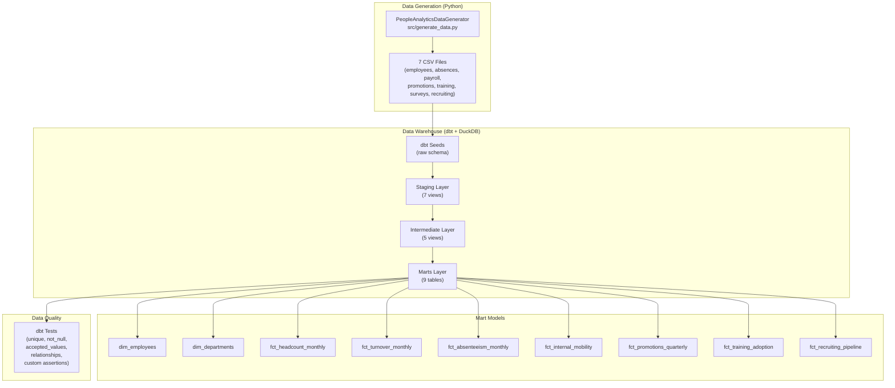
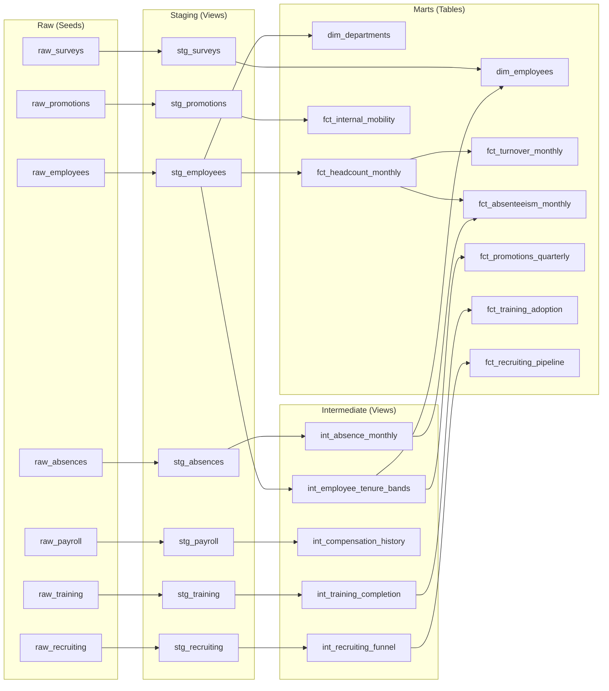

# Architecture — People Analytics DWH

## System Overview

## dbt Layer Architecture

## Semantic Layer Mapping

How mart models map to enterprise People Analytics dashboards (TOTVS RH, Workday, SAP SF):

| Mart Model | HR KPI | Enterprise Dashboard Equivalent |
|-----------|--------|-------------------------------|
| fct_headcount_monthly | Headcount, Growth Rate | Workforce Planning |
| fct_turnover_monthly | Turnover Rate (Vol/Invol) | Attrition Dashboard |
| fct_absenteeism_monthly | Absence Rate, Bradford Factor | Absenteeism Monitor |
| fct_internal_mobility | Mobility Rate, Promotion Rate | Career Development |
| fct_promotions_quarterly | Promotion Equity by Gender/Age | DEI & Equity Analytics |
| fct_training_adoption | Completion Rate, Compliance | Learning & Development |
| fct_recruiting_pipeline | Time-to-Fill, Source ROI | Talent Acquisition |
| dim_employees | Employee 360 Profile | Employee Directory |
| dim_departments | Department Scorecard | Organizational Health |

## Technology Stack

| Component | Technology | Purpose |
|-----------|-----------|---------|
| Data Generation | Python + Faker + NumPy | Synthetic HR data with realistic correlations |
| Warehouse | DuckDB | Embedded analytical database (zero infrastructure) |
| Transformation | dbt-core + dbt-duckdb | SQL-based data transformation + testing |
| Testing | dbt tests + pytest | Data quality (dbt) + generator correctness (pytest) |
| CI/CD | GitHub Actions | Lint, test, dbt build on every push |
| Containerization | Docker + Docker Compose | Reproducible pipeline execution |
